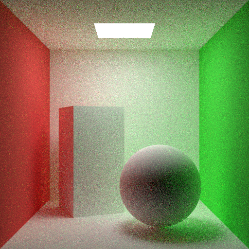
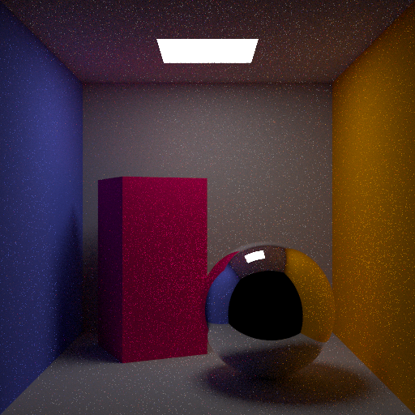
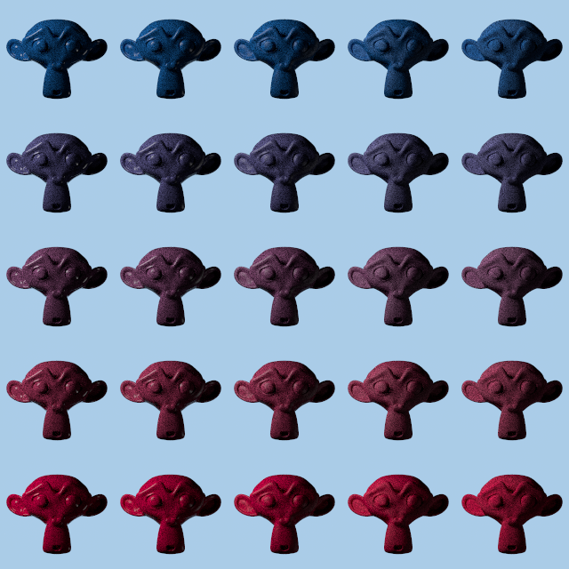
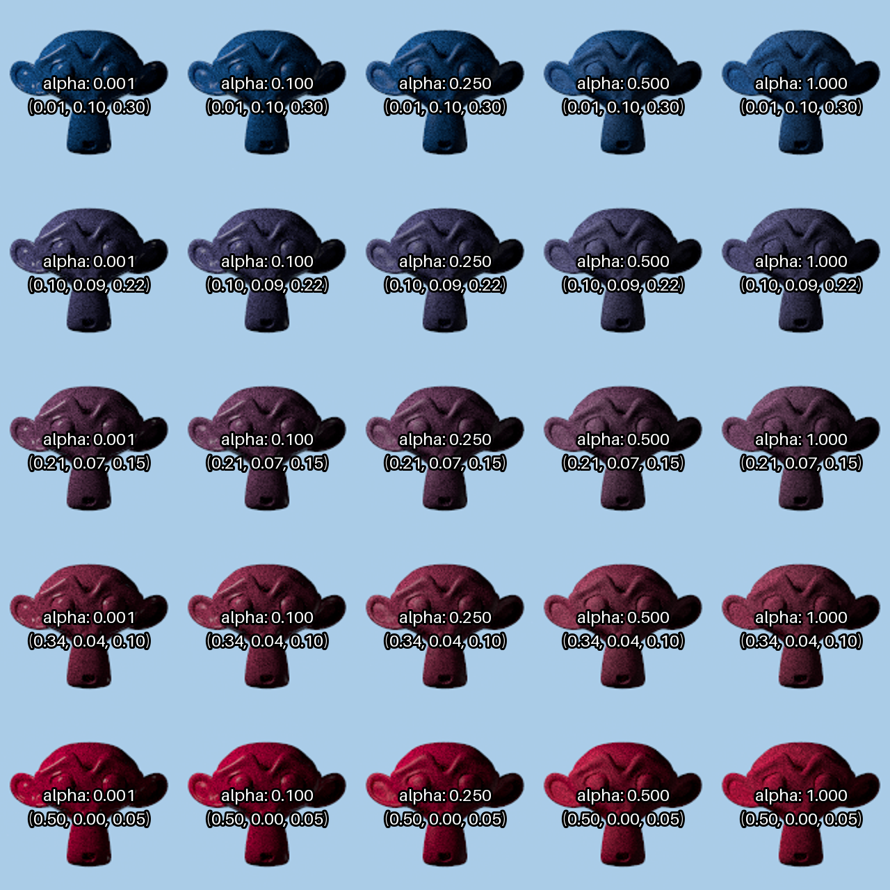

# Validation-Tools

A simple framework to speed up validation for projects made with [Nori](https://github.com/wjakob/nori).

## Features

- Programmatically generates scenes for Nori and Mitsuba
- Automatically renders to png and exr
- Utilities for presentation like arranging images in a grid

## Installation

Make sure you're in the Nori root directory. Then, clone this repository and rename it to `validation`:

```bash
git clone https://github.com/TheCodecOfficial/Validation-Tools
mv Validation-Tools validation
```

Create the conda environment:

```bash
conda env create -f environment.yml
```

Or, if you prefer a different environment manager, install the required packages from `requirements.txt`:

```bash
pip install -r requirements.txt
```

Activate the environment:

```bash
conda activate nori
```

Test the installation by running one of the example scripts:

```bash
python validation/cbox_example_1.py
```

> [!IMPORTANT]  
> Python version 3.14 is not supported at the moment. You can use any Python version from 3.11 to 3.13. Older versions might also work, but have not been tested.

## Usage

### Basic Usage

For each validation test, you will need to create a `ValidationSuite` instance. The name should be unique as it is used to create a directory for the scenes, renders and logs.

For this example, let's use a pre-built Cornell box scene from `scenegen`. After creating a scene, register it with the validation suite. Registering will create the actual scene XML files. Finally, call the `render()` method to start the rendering process for Nori and Mitsuba.

```python
from validation_tools.scenegen import make_cbox_scene
from validation_tools.validation import ValidationSuite

val = ValidationSuite("cbox_example_1")

cbox = make_cbox_scene()

val.register_scene(cbox)
val.render()
```

> [!IMPORTANT]  
> Make sure to run the script from the Nori root directory, so that the Nori executable can be found. The script assumes that the Nori executable is located at `./build/nori`.

Running this example will generate the following renders:

| Nori Render | Mitsuba Render |
|----------------|------------------|
|  |  |

All associated files (logs, scenes, renders) can be found in `scenes/cbox_example_1/`:
```
scenes
└── cbox_example_1
    ├── logs
    │   ├── cbox_0_mitsuba.log
    │   └── cbox_0_nori.log
    ├── renders
    │   ├── cbox_0_mitsuba.exr
    │   ├── cbox_0_mitsuba.png
    │   ├── cbox_0_nori.exr
    │   └── cbox_0_nori.png
    └── scenes
        ├── cbox_0_mitsuba.xml
        └── cbox_0_nori.xml
```

### Advanced Settings

The Cornell box scene is fully customizable. Additionally, you can easily create materials using the `make_material()` function by specifying the name of the shader. Materials are assigned to objects using `set_bsdf(object, bsdf)`. In the Cornell box scene, the objects are named "main_walls", "left_wall", "right_wall", "emitter", "cuboid" and "ball".

The render quality (resolution and SPP) can be changed with `set_quality()` with the following options:

| Quality Setting | Resolution | SPP |
|-----------------|------------|-----|
| l (low)         | 256×256    | 16  |
| m (medium)      | 512×512    | 32  |
| h (high)        | 512×512    | 512 |
| final/report    | 1024×1024  | 1024|

```python
from validation_tools.scenegen import make_cbox_scene, make_material
from validation_tools.validation import ValidationSuite

val = ValidationSuite("cbox_example_2")

cbox = make_cbox_scene(
    "custom_cbox",
    left_wall_color=(0.15, 0.2, 1),
    right_wall_color=(0.95, 0.4, 0),
    emitter_color=(5, 5, 5),
    main_wall_color=(0.5, 0.5, 0.5),
    cuboid_color=(1, 0, 0.2),
)
cbox.set_quality("m")

mirror = make_material("mirror")
cbox.set_bsdf("ball", mirror)

val.register_scene(cbox)
val.render()
```

Running this example will generate the following renders:

| Nori Render | Mitsuba Render |
|----------------|------------------|
|  |  |

### Image Grids

We often want to show many renders side-by-side with a varying parameter. In the following example, we'll create a sequence of renders with varying color. This time, let's use the material preview scene. In the Material Preview scene, the objects are named "material_preview", "keylight", "filllight" and "rimlight". To loop over colors, we can use the `color_range` utility.

``` python
from validation_tools.scenegen import make_mat_prev_scene, make_material
from validation_tools.validation import ValidationSuite
from validation_tools.color_util import color_range

scene = make_mat_prev_scene()
scene.set_spp(128)
scene.set_resolution(128, 128)

val = ValidationSuite("grid_example_1")

for color in color_range((1, 0.25, 0), (0.9, 0.03, 0.2), n=7):
    material = make_material("diffuse", albedo=color)
    scene.set_bsdf("material_preview", material)

    val.register_scene(scene)

val.render()
val.make_grid(cell_resolution=128)
```

If no rows or cols are specified, it will arange the renders in a single strip (separately for Nori and Mitsuba). Running this example will generate the following grids:


### Advanced Image Grids

In this example we loop over both colors and roughness (alpha) values for the microfacet model. In the end, we can arrange the renders in a grid by specifying the number of rows and/or columns. Interpolating linear rgb values sometimes creates unpleasant and non-uniform steps. If you think that the colors seem off, you can try interpolating in the [Oklab](https://bottosson.github.io/posts/oklab/) color space, which is a perceptually uniform color space and often generates more pleasing results.

Sometimes it can be difficult to visually distinguish between different parameters. To help with this, you can assign a label to each scene and generate a labelled grid alongside the regular one.

``` python
from validation_tools.scenegen import make_mat_prev_scene, make_material
from validation_tools.validation import ValidationSuite
from validation_tools.color_util import color_range, color_to_str

scene = make_mat_prev_scene()
scene.set_spp(128)
scene.set_resolution(128, 128)

val = ValidationSuite("grid_example_2", nori_only=True)

for color in color_range((0.01, 0.1, 0.3), (0.5, 0, 0.05), n=5, use_oklab=True):
    for alpha in [0.001, 0.1, 0.25, 0.5, 1]:
        material = make_material("microfacet", kd=color, alpha=alpha)
        scene.set_bsdf("material_preview", material)

        val.register_scene(scene, label=f"alpha: {alpha:.3f}\n{color_to_str(color)}")

val.render()
val.make_grid("color_roughness_grid", cell_resolution=128, cols=5, generate_labels=True)
```
> [!NOTE]
> Here, we set `nori_only=True`, since there is no one-to-one correspondence for the microfacet model in Mitsuba. The simple nori to mitsuba converted will thus ignore this case leading to Mitsuba not recognizing the bsdf type.

Running this example will generate the following renders:

| Grid | Labeled Grid |
|----------------|------------------|
|  |  |

> [!NOTE]
> A labeled grid is always going to have the same cell resolution of 256 x 256 pixels, regardless of the specified `cell_resolution` parameter. This is to ensure that the labels remain legible. The regular grid (that gets generated alongside the labeled one) will use the specified `cell_resolution`. Currently, all cells in a grid are square.

## Implementation Overview
- `color_util.py`: Color utilities for generating color ranges (in Oklab) and converting colors to strings.
- `exr_util.py`: Utilities for reading and writing EXR files. Used internally to create EXR image grids.
- `nori_to_mitsuba.py`: Converts Nori scene XMLs to Mitsuba-compatible XMLs. See [Nori to Mitsuba Converter](https://github.com/TheCodecOfficial/NoriToMitsuba) for supported features and limitations.
- `scenegen.py`: Scene generation utilities. Comes with two pre-built scenes: Cornell box and material preview.
- `validation.py`: Core validation suite functionality. Manages scene registration, rendering and image grid generation.

## TODO

- Add option to use pre-generated Nori scenes